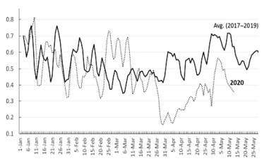
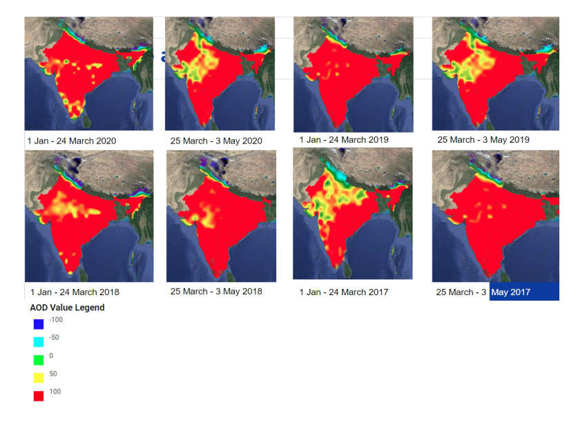

# GIS Final Project

## The impact of COVID-19 lockdown on air quality
### Israel Gebre

---

### Introduction
The COVID-19 pandemic has had a significant impact on global health and economic systems. The World Health Organization labeled the outbreak a global pandemic on January 30, 2020, indicating the urgent need for action to stop the virus's spread. In reaction to the fast spread of COVID-19, several countries enacted lockdowns, which included the closure of non-essential enterprises as well as limitations on transportation and social gatherings. These safeguards were put in place to restrict the spread of the virus and reduce the strain on healthcare services. The lockdowns had substantial economic and social effects, including disruptions in the transportation and industrial sectors, as well as a reduction in worldwide fossil fuel consumption.

In India, the first case of COVID-19 was reported in the state of Kerala on January 30, 2020. In response to the growing threat of the virus, the Indian government implemented a nationwide lockdown on March 22, 2020, which was subsequently extended for 21 days starting on March 24, 2020. During the lockdown, all public gathering places in the country were closed, providing a unique opportunity to generate baseline data on air quality during a period of minimal anthropogenic activity.

To understand the impact of the lockdown on air quality and inform future mitigation policies, it is necessary to conduct a quantitative assessment of air quality variables. The goal of this study is to assess the changes in ambient air quality that occurred during the lockdown and subsequent unlock phases in India. To achieve this, I will analyze data on air pollutant concentrations and meteorological parameters using machine learning techniques. Data sources for this analysis will include Terra & Aqua MAIAC Land Aerosol Optical Depth (MODIS/006/MCD19A2_GRANULES) satellite data to evaluate the impact of fires on air quality. By identifying trends and patterns and understanding the complex relationships between emission sources, meteorology, and air quality, this research aims to provide valuable insights for the development of future air quality policies and actions in India.

---

### Prior Studies and Existing Literature
Several studies have examined the impact of the COVID-19 pandemic on air quality, with varying results. A study published in Environmental Research Letters found that the lockdowns implemented in China resulted in a significant decrease in air pollution, with reductions in PM2.5 concentrations ranging from 20-50%. Another study published in Nature Sustainability found that the lockdowns in India led to a reduction in particulate matter and nitrogen dioxide concentrations, as well as an increase in ozone concentrations.

On the other hand, a study published in Environmental Science & Technology found that the decrease in transportation and industrial activity during the pandemic led to a reduction in fine particulate matter concentrations in several cities in the United States, but that these reductions were not sustained once lockdowns were lifted. A study published in Environmental Research Letters also found that the decrease in air pollution during the pandemic led to an increase in life expectancy in some areas, but that this gain may be offset by the negative health impacts of the pandemic itself.

These studies highlight the complex and varied impacts of the COVID-19 pandemic on air quality, and the importance of conducting further research to understand the long-term effects and inform the developing effective strategies for addressing air quality issues.

---

### Methodology

#### Data Collection
This study involved using Google Earth Engine to analyze satellite data from the Terra and Aqua MAIAC Land Aerosol Optical Depth (MODIS/006/MCD19A2_GRANULES) dataset, covering the period from January 1, 2017, to May 3, 2020. The dataset provides daily global estimates of aerosol optical depth at a resolution of 10x10 km. It includes information on the concentration of various aerosols in the atmosphere and their ability to absorb or scatter light. In this study, I focused on the Optical_Depth_047 band, which specifically measures the concentration of fine particulate matter in the air.

```python
# Define the image collections for each year
var imgCollection2017 = ee.ImageCollection('MODIS/006/MCD19A2_GRANULES').select('Optical_Depth_047').filterDate('2017-01-01', '2017-03-24')

var imgCollection2017_lockdown = ee.ImageCollection('MODIS/006/MCD19A2_GRANULES').select('Optical_Depth_047').filterDate('2017-03-25', '2017-05-03')

var imgCollection2018 = ee.ImageCollection('MODIS/006/MCD19A2_GRANULES').select('Optical_Depth_047').filterDate('2018-01-01')
```

#### Data Processing and Analysis
I will analyze data from the years 2017 to 2020 to compare the air quality during lockdown periods to pre-lockdown periods in each year. The code first defines image collections for each year, separated by lockdown and pre-lockdown periods. These image collections are created using the "ee.ImageCollection" function and filtered by date using the "filterDate" method. The code then calculates the "mean" value for each image collection using the mean function.

```python
# Calculate the mean value for each image collection
var mean2017 = imgCollection2017.mean()
var mean2017_lockdown = imgCollection2017_lockdown.mean()
var mean2018 = imgCollection2018.mean()
var mean2018_lockdown = imgCollection2018_lockdown.mean()
var mean2019 = imgCollection2019.mean()
var mean2019_lockdown = imgCollection2019_lockdown.mean()
var mean2020 = imgCollection2020.mean()
var mean2020_lockdown = imgCollection2020_lockdown.mean()
```

Next, it subtracts the mean value of the pre-lockdown period from the mean value of the lockdown period to get the difference between the two periods.

```python
# Calculate the difference between the lockdown and pre-lockdown periods
var diff2017 = mean2017_lockdown.subtract(mean2017)
var diff2018 = mean2018_lockdown.subtract(mean2018)
var diff2019 = mean2019_lockdown.subtract(mean2019)
var diff2020 = mean2020_lockdown.subtract(mean2020)
```

To focus the analysis on a specific region of India and exclude areas outside of the region, I used the "clipToCollection" function to clip the image collections and difference maps to a region of interest, defined as a boundary shapefile imported as a table.

```python
# Add the difference maps to the map
Map.addLayer(diff2017.clipToCollection(region), band_viz, 'Difference 2017')
Map.addLayer(diff2018.clipToCollection(region), band_viz, 'Difference 2018')
Map.addLayer(diff2019.clipToCollection(region), band_viz, 'Difference 2019')
Map.addLayer(diff2020.clipToCollection(region), band_viz, 'Difference 2020')
```

#### Data Visualization
The resulting difference maps are visualized using the "Map.addLayer" function and the specified visualization parameters. The code also includes a section that creates lists of the image collections and mean values for each year, and uses these lists to create a chart showing the mean optical depth of aerosols during the lockdown and unlock phases. The chart is generated using the "ui.Chart.image.seriesByRegion" function, which takes a list of image collections and a region of interest as inputs, and returns a chart of the mean values for each region.

```python
# Create a list of the image collections to include in the chart
var imgCollections = [imgCollection2017, imgCollection2017_lockdown, imgCollection2018, imgCollection2018_lockdown, imgCollection2019, imgCollection2019_lockdown, imgCollection2020, imgCollection2020_lockdown]

# Create a list of labels for the image collections
var labels = ['2017', '2017 lockdown', '2018', '2018 lockdown', '2019', '2019 lockdown', '2020', '2020 lockdown']

# Calculate the mean values for each image collection
var means = imgCollections.map(function(imgCollection) { return imgCollection.mean();})

# Create the bar chart
var chart = ui.Chart.image.series(means, region, ee.Reducer.mean(), 500).setOptions({
    title: 'Mean AOD value',
    hAxis: {title: 'Year'},
    vAxis: {title: 'Mean AOD value'},
    series: {0: {color: 'blue'}, 1: {color: 'red'}, 2: {color: 'blue'}, 3: {color: 'red'}, 4: {color: 'blue'}, 5: {color: 'red'}, 6: {color: 'blue'}, 7: {color: 'red'}}
})

# Display the chart
print(chart)
```

This difference map is then used to visualize and analyze the changes in air quality during the lockdown periods. However, I were not able to visualize and analyze the changes in air quality during the lockdown periods because the Google Earth Engine had a memory limit and I exceeded this limit when trying to do the visualization and analysis.

For that, I wrote a code that is intended to export data from the image collection diff2017 for a series of regions within India. The regions are defined as polygons buffered around a central region of India by increasing distances. The process is repeated 30 times to create a list of 30 regions.

The image collection is first converted to a feature collection using the map function. This is done so that the image collection can be used with the clipToCollection function. The clipToCollection function is used to clip the image collection to the region of interest defined as the current region in the loop.

Inside the loop, the code defines the export parameters using an object literal. These parameters include the image to be exported (the clipped diff2017 image collection), a description for the exported image, the scale of the image (500 meters per pixel), the region to be exported, the coordinate reference system (CRS) of the image, the maximum number of pixels, the file format (GeoTIFF), and the folder to save the exported image to.

```javascript
// Define the region for India
var region = ee.Geometry.Polygon([
  [[68.1766455078125, 7.965534700859665],
  [97.0322265625, 7.965534700859665],
  [97.0322265625, 37.3424448006414],
  [68.1766455078125, 37.3424448006414],
  [68.1766455078125, 7.965534700859665]]
]);

// Create a list of 30 regions by buffering the region
var regions = [];
for (var i = 1; i <= 30; i++) {
  regions.push(region.buffer(i * 10e3));
}

// Convert the image collection to a feature collection
var featureCollection = imgCollection2017.map(function(image) {
  return ee.Feature(ee.Geometry(image.geometry()), {image: image});
});

// Iterate over the list of regions
for (var i = 0; i < regions.length; i++) {
  // Set the region for the current iteration
  var region = regions[i];
  
  // Define the export parameters
  var params = {
    image: diff2017.clipToCollection(featureCollection),
    description: 'Difference_2017_region_' + (i + 1),
    scale: 500,
    region: region,
    crs: 'EPSG:4326',
    maxPixels: 1e13,
    fileFormat: 'GeoTIFF',
    formatOptions: { cloudOptimized: true },
    folder: 'my_folder'
  };
  
  // Export the image for the current region
  Export.image.toDrive(params);
}
```


Finally, the Export.image.toDrive function is used to export the image for the current region using the defined export parameters. This process is repeated for all 30 regions in the list. Next, QGIS is used to merge multiple GeoTIFF files for each period. The AOD values are then extracted to a CSV file and plotted as a time series graph in QGIS.


### Results and Discussion

Spatial distribution of AOD during the PLD and DLD time period in 2017–2020. Thespatial distribution shows that there is a drastic decrease of aerosol loading during DLD compared to PLD period of 2020. This decrease is clearly visible over the north regions, whereas AOD did not substantially decrease over the central–eastern region. Overall aerosol loading shows a decrease compared to the same time period of DLD of 2017–2019. In spite of this, the overallAOD values from 25 March 2020 onwards till May are at its lowest corresponding to the three years AOD average.




The lockdown period allowed for the collection of baseline data on air qualityduring periods of minimal human activity. Combining satellite data with ground data gives us a regional and specific understanding of air quality. If there is a decrease in AOD (aerosol optical depth) decreases, it suggests that air quality may improve if actions are implemented to minimize the use of fossil fuels. Shutting down the economy to improve air quality is not a viable answer, but smaller-scale actions might be conducted on a regular basis.





# References

Bao, R., & Zhang, A. (2020). Does lockdown reduce air pollution? Evidence from 44 cities in Northern China. *Science of The Total Environment, 731*, 139052. https://doi.org/10.1016/j.scitotenv.2020.139052

Bezyk, Y., Sówka, I., Górka, M., & Blachowski, J. (2021). GIS-based approach to spatio-temporal interpolation of atmospheric CO2 concentrations in Limited Monitoring Dataset. *Atmosphere, 12*(3), 384. https://doi.org/10.3390/atmos12030384

Bhunia, G. S., & Ding, D. (2020). Temporal and spatial statistical analysis of ambient air quality of Assam (India). *Journal of the Air & Waste Management Association, 70*(8), 775–794. https://doi.org/10.1080/10962247.2020.1772406

Dantas, G., Siciliano, B., França, B. B., da Silva, C. M., & Arbilla, G. (2020). The impact of COVID-19 partial lockdown on the air quality of the city of Rio de Janeiro, Brazil. *Science of The Total Environment, 729*, 139085. https://doi.org/10.1016/j.scitotenv.2020.139085

Kang, M., Ahn, M.-H., Liu, X., Jeong, U., & Kim, J. (2020). Spectral calibration algorithm for the Geostationary Environment Monitoring Spectrometer (GEMS). *Remote Sensing, 12*(17), 2846. https://doi.org/10.3390/rs12172846

Kant, Y., Mitra, D., & Chauhan, P. (2020). Space-based observations on the impact of COVID-19-induced lockdown on aerosols over India. *Current Science, 119*(3), 539. https://doi.org/10.18520/cs/v119/i3/539-544

Kerimray, A., Baimatova, N., Ibragimova, O. P., Bukenov, B., Kenessov, B., Plotitsyn, P., & Karaca, F. (2020). Assessing air quality changes in large cities during COVID-19 lockdowns: The impacts of traffic-free urban conditions in Almaty, Kazakhstan. *Science of The Total Environment, 730*, 139179. https://doi.org/10.1016/j.scitotenv.2020.139179

